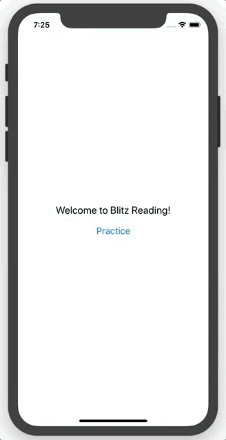

# Blitz Reading

The mobile application which helps to practice and track the amount of sights words a kid can read.

The development process is described in the ["What did I learn" blog](http://whatdidilearn.info/tags#BlitzReading).

## Example

